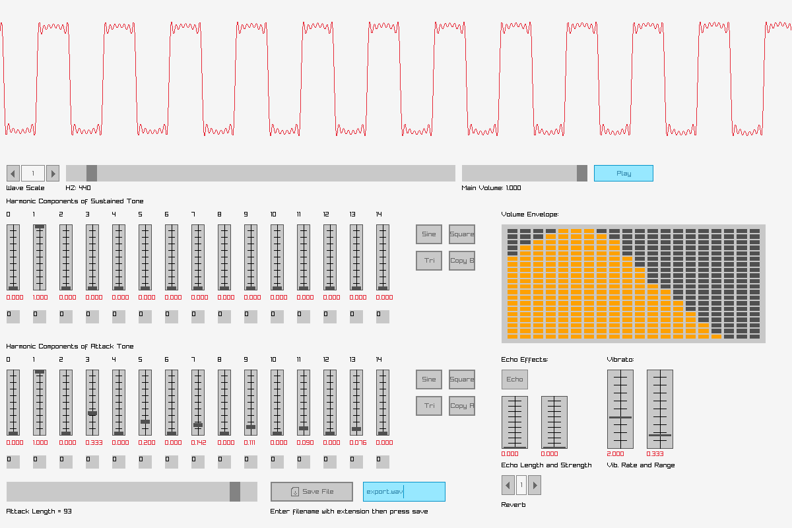

# A simple harmonic synthesizer

## What does it do?

It creates an audio wave according to various parameters, displays it, plays it, and allows you to save it.

It demonstrates the basics of a digital synthesizer, creating tones of various timbres by adding harmonic overtones, shaping the volume envelope (attack, decay, sustain, release), and adding basic echo and vibrato effects.  It can also be used to demonstrate Fourier synthesis of waveforms.

## Screenshot

## Explanation of GUI
Starting in the upper left of the GUI:

**Wave Scale** Increase to display more of the wave on the screen at one time.  The display scrolls through the entire 1 second of the wave form at 1 sample per pixel of width at a scale of 1, 2 samples per pixel of width at a scale of 2, etc.  *Keyboad shortcut:* Left arrow decreases, right arrow increases.

**HZ** Set the frequency of the fundamental tone here.  *Keyboard shortcut:* Up arrow increases frequency, down arrow decreases.  Useful for getting the exact frequency that you want.

**Main volume** Adjusts playback volume only.  Does not alter height of waveform, which is normalized.

**Play** Plays the sound.  *Keyboard shortcut:* P.

Next group of controls:

**Harmonic Components** This is where it all happens.  Above each vertical slider is a number which indicates a multiple of the fundamental frequency which is set by the **Hz** control.  One is the fundamental frequency itself.  Two is twice the fundamental frequency, etc.  Adjust the slider to add more or less of each harmonic to the waveform.  Zero is a DC offset; leave it off in most cases.  

Below each slider is a small clickable box which is **Phase Shift** in increments of 45 degrees per click.  (The default wave is sine.  So setting to 90 gives you cosine if you want that instead to build various Fourier series.)

To the right of the sliders are convenience buttons.  **Sine** resets the controls to a pure sine wave, the default setting (Harmonic component 1 = 1.0, all others = 0.0).  **Square** sets the Fourier series components for a square wave.  **Tri** sets the Fourier series components for a triangle (sawtooth) wave.  **Copy B/A** will copy whatever is set in the *other* bank of harmonic controls.

There are two rows of harmonic components controls.

**Harmonics of Attack Tone** These harmonics sound at first, then fade into the **Harmonics of the Sustained Tone** by linear interpolation.

**Attack Length slider** determines how long the harmonics of the attack tone last, as a percentage of the whole 1 second sound.  Therefore a setting of 25% would make the attack tone last for 0.25sec before transitioning entirely into the harmonics of the sustained tone.

To the right of the attack length slider is the **save button** to export your sound as a .wav file.  But first, supply a file name with extension in the box to the right.

Moving on to the upper right corner:

**Volume Envelope** determines the loudness of the sound over time.  Similar to ASDR (Attack, Decay, Sustain and Release) settings on synthesizers, except it's more flexible.  You can determine whatever levels you want.  Just left-click and mouse over the LEDs to set the levels.  Want zero?  Left-click with your mouse beneath the lowest LED but still inside the boundry of the control itself (the little grey area beneath the lowest LED).  Want more levels?  You can change the number of bands (columns) and the number of levels per band (rows) easily in the code.

**Echo effects** are really primitive.  The echo is created in the old-school tape-recorder way: a fainter copy of the waveform is simply mixed in a few moments later.  Echo length sets the delay until the first echo sounds.  An echo length of 0.25 would therefore first introduce the echo at 0.25 seconds into the waveform.  Echo strength determines how loud the echo is.  So an echo length of 0.20 with a strenth of 0.30 would, beginning at 0.20 seconds into the wave, mix 70% of the original sound with 30% of the waveform that is 0.20s earlier and continue to do this until the end of the wave.

**Reverb** determines how many such echos you will get.  So the minimum setting is one.  More than one introduces more echoes, by simply remixing as described above multiple times.

**Vibrato** varies the frequency of the fundamental tone slowly over time in a sinusoidal fashion, i.e., a frequency modulation (FM).  **Vibrato rate** determines how fast a vibrato is made.  Current range is 0 to 5 Hz, but it can easily be changed in the code if that's too narrow a limit.  **Vibrato range** determines how much the fundamental frequency modulates.  I kept the upper limit modest to keep the effect sounding like an actual vibrato, but increasing the upper limit leads to interesting, theremin-like sounds.

## Why did I make it?
To explain how digital synthesis of musical sounds works to my son.  RayLib and RayGUI made it easy to build the interface.

## Potential improvememnts:
- Add an easy way to select musical notes rather than dial-by-Hz
- Add more convenience settings using harmonic components from real instruments
- It seems that really accurate instrument sounds would require a sequence of many different harmonic components over time, not just an initial attack and then sustain harmonics, which add only a little real-world feel to the sound. It would be nice to be able to load a stack of harmonic components and lerp through them as we go from the beginning of the wave to the end, similar to how the volume envelope is applied to amplitude.
