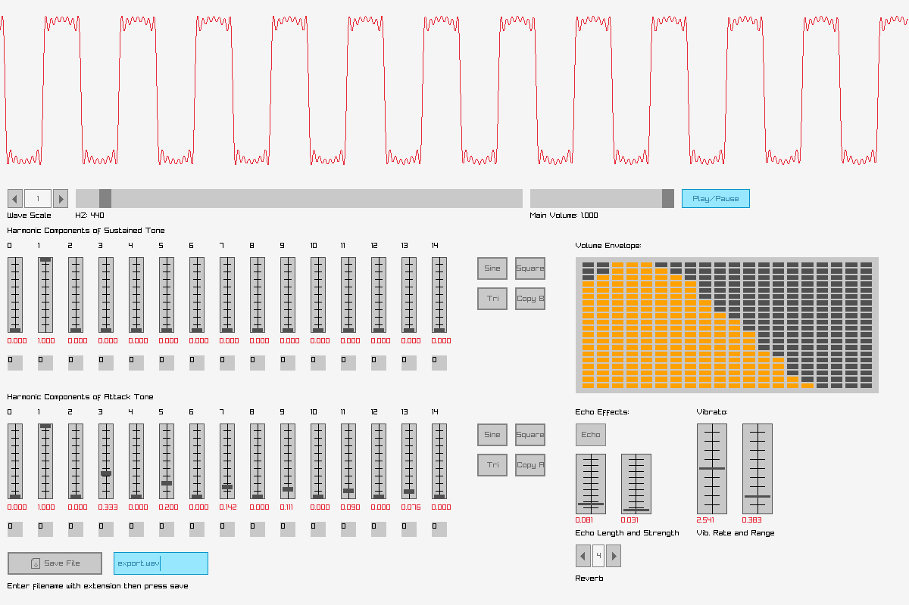

# A simple harmonic synthesizer

## What does it do?

It creates an audio wave according to various parameters, displays it, plays it, and allows you to save it.

It demonstrates the basics of a digital synthesizer, creating tones of various timbres by adding harmonic overtones, shaping the volume envelope (attack, decay, sustain, release), and adding basic echo and vibrato effects.  It can also be used to demonstrate Fourier synthesis of waveforms.

## Screenshot

## Explanation of GUI
Starting in the upper left of the GUI:

**Wave Scale** Increase to display more of the wave on the screen at one time.  The display scrolls through the entire 1 second of the wave form at 1 sample per pixel of width at a scale of 1, 2 samples per pixel of width at a scale of 2, etc.  *Keyboad shortcuts:* Left arrow decreases, right arrow increases.

**HZ** Set the frequency of the fundamental tone here.  *Keyboard shortcuts:"* Up arrow increases Hertz, down arrow decreases.  Useful for getting the exact frequency that you want.

**Main volume** Adjusts playback volume only.  Does not alter height of waveform, which is normalized.

**Play / Pause** Plays the sound.

Next row of controls:

**Harmonic Components** This is where it all happens.  Above each vertical slider is a number which indicates a multiple of the fundamental frequency which is set by the **Hz** control.  One is the fundamental frequency itself.  Two is twice the fundamental frequency, etc.  Adjust the slider to add more or less of each harmonic to the waveform.  Zero is a DC offset; leave it off in most cases.  

Below each slider is a small clickable box which is **Phase Shift** in increments of 45 degrees per click.  (The default wave form is sine.  So setting to 90 gives you cosine if you want that.)

There are two rows of harmonic components controls.

**Harmonics of Attack Tone** These harmonics sound at first, then fade into the **Harmonics of the Sustained Tone**

